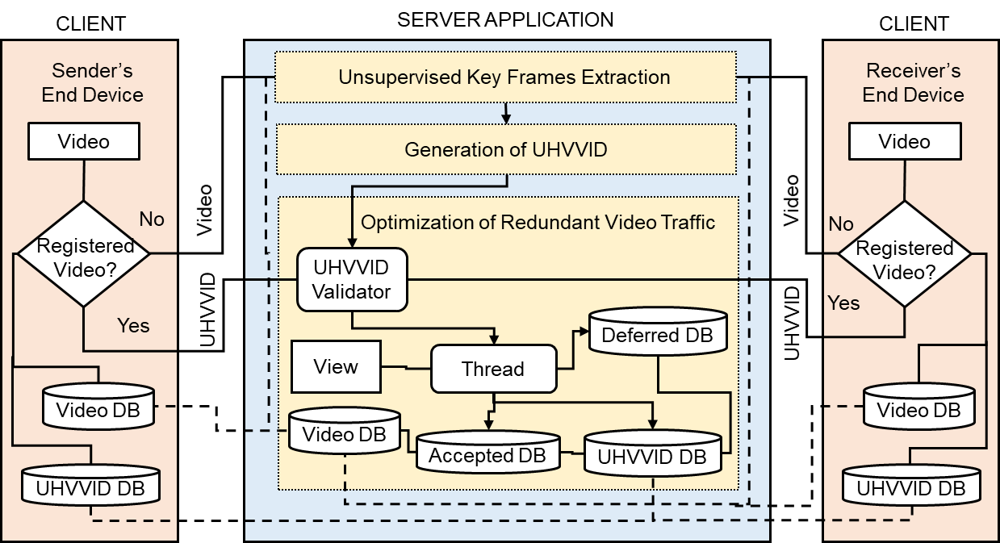

#tensorflow-Optimizing-Social-Media-Video-Traffic-by-Identifying-Identical-Videos-using-Deep-Learning-Techniques
This repo contains the Python implementation of the TVC'25 paper - [Optimizing Social Media Video Traffic by Identifying Identical Videos using Deep Learning Techniques]. The original TensorFlow/PyTorch implementation can be found [here](https://github.com/chenlepkonyak/optimization-of-osn-video-traffic-by-identifying-identical-videos-using-dl-techniques). 

<div align="center">
  
</div>

The main requirements are [pytorch]( https://www.tensorflow.org/) (`2.18.0`) and python `3.11`. Some dependencies that may not be installed in your machine are [moviepy](https://pypi.org/project/moviepy/), [kneed](https://pypi.org/project/kneed/), [opencv-python](https://pypi.org/project/opencv-python/), [scikit-learn](https://pypi.org/project/scikit-learn/), [scikit-image](https://pypi.org/project/scikit-image/), [scipy](https://pypi.org/project/scipy/), [pandas](https://pypi.org/project/pandas/) and [numpy](https://pypi.org/project/numpy/). Please install other missing dependencies.

## Get started
1. Download preprocessed datasets
```bash
git clone https://github.com/chenlepkonyak/optimization-of-osn-video-traffic-by-identifying-identical-videos-using-dl-techniques
cd optimization-of-osn-video-traffic-by-identifying-identical-videos-using-dl-techniques


The [HMDB51](https://doi.org/10.1109/ICCV.2011.6126543) dataset is a large collection of realistic videos from various sources, including movies and web videos. The dataset is composed of 6,766 video clips from 51 action categories (such as “jump”, “kiss” and “laugh”), with each category containing at least 101 clips.  
# download datasets_and_experimental_and_analysis_data.tar.gz (173.5MB) contains 1.Setting for HDM51 video Datasets for experiment, 2️.Self-Generated Datasets(server_users_metadata_db) and other 207+ files data accessed through sqlite database is also included which is used for results and analysis data(sever_all_traffic_db).

wget http://www.eecs.qmul.ac.uk/~kz303/vsumm-reinforce/datasets.tar.gz
tar -xvzf datasets.tar.gz
```


2. Make splits
```bash
python create_split.py -d datasets/eccv16_dataset_summe_google_pool5.h5 --save-dir datasets --save-name summe_splits  --num-splits 5
```
As a result, the dataset is randomly split for 5 times, which are saved as json file.

Train and test codes are written in `main.py`. To see the detailed arguments, please do `python main.py -h`.

## How to train
```bash
python main.py -d datasets/eccv16_dataset_summe_google_pool5.h5 -s datasets/summe_splits.json -m summe --gpu 0 --save-dir log/summe-split0 --split-id 0 --verbose
```

## How to test
```bash
python main.py -d datasets/eccv16_dataset_summe_google_pool5.h5 -s datasets/summe_splits.json -m summe --gpu 0 --save-dir log/summe-split0 --split-id 0 --evaluate --resume path_to_your_model.pth.tar --verbose --save-results
```

If argument `--save-results` is enabled, output results will be saved to `results.h5` under the same folder specified by `--save-dir`. To visualize the score-vs-gtscore, simple do
```bash
python visualize_results.py -p path_to/result.h5
```

## Plot
We provide codes to plot the rewards obtained at each epoch. Use `parse_log.py` to plot the average rewards
```bash
python parse_log.py -p path_to/log_train.txt
```
The plotted image would look like
<div align="center">
  
</div>

If you wanna plot the epoch-reward curve for some specific videos, do
```bash
python parse_json.py -p path_to/rewards.json -i 0
```

You will obtain images like
<div align="center">
  
  
  
</div>

If you prefer to visualize the epoch-reward curve for all training videos, try `parse_json.sh`. Modify the code according to your purpose.

## Visualize summary
You can use `summary2video.py` to transform the binary `machine_summary` to real summary video. You need to have a directory containing video frames. The code will automatically write summary frames to a video where the frame rate can be controlled. Use the following command to generate a `.mp4` video
```bash
python summary2video.py -p path_to/result.h5 -d path_to/video_frames -i 0 --fps 30 --save-dir log --save-name summary.mp4
```
Please remember to specify the naming format of your video frames on this [line](https://github.com/KaiyangZhou/pytorch-vsumm-reinforce/blob/master/summary2video.py#L22).

## How to use your own data
We preprocess data by extracting image features for videos and save them to `h5` file. The file format looks like [this](https://github.com/KaiyangZhou/vsumm-reinforce/issues/1#issuecomment-363492711). After that, you can make split via `create_split.py`. If you wanna train policy network using the entire dataset, just do `train_keys = dataset.keys()`. [Here](https://github.com/KaiyangZhou/pytorch-vsumm-reinforce/blob/master/main.py#L75) is the code where we initialize dataset. If you have any problems, feel free to contact me by email or raise an `issue`.

## Citation
```
@article{zhou2017reinforcevsumm, 
   title={Deep Reinforcement Learning for Unsupervised Video Summarization with Diversity-Representativeness Reward},
   author={Zhou, Kaiyang and Qiao, Yu and Xiang, Tao}, 
   journal={arXiv:1801.00054}, 
   year={2017} 
}
```
